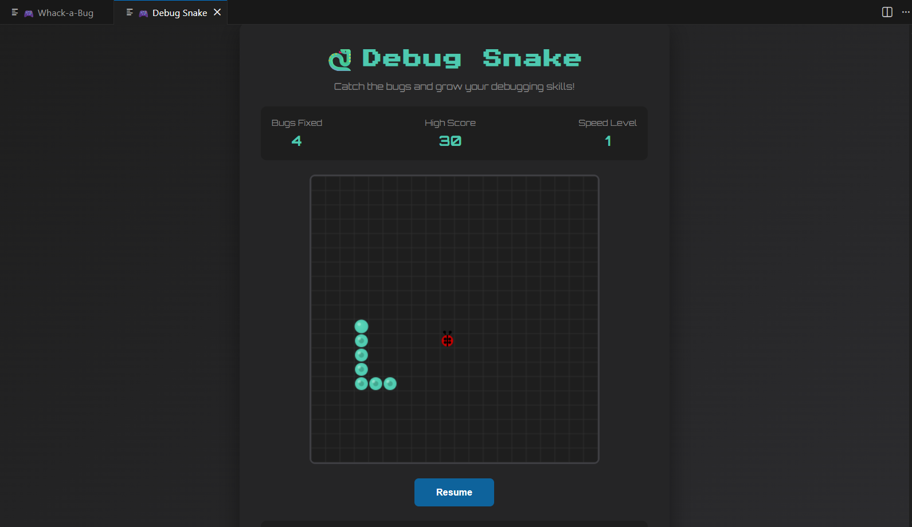
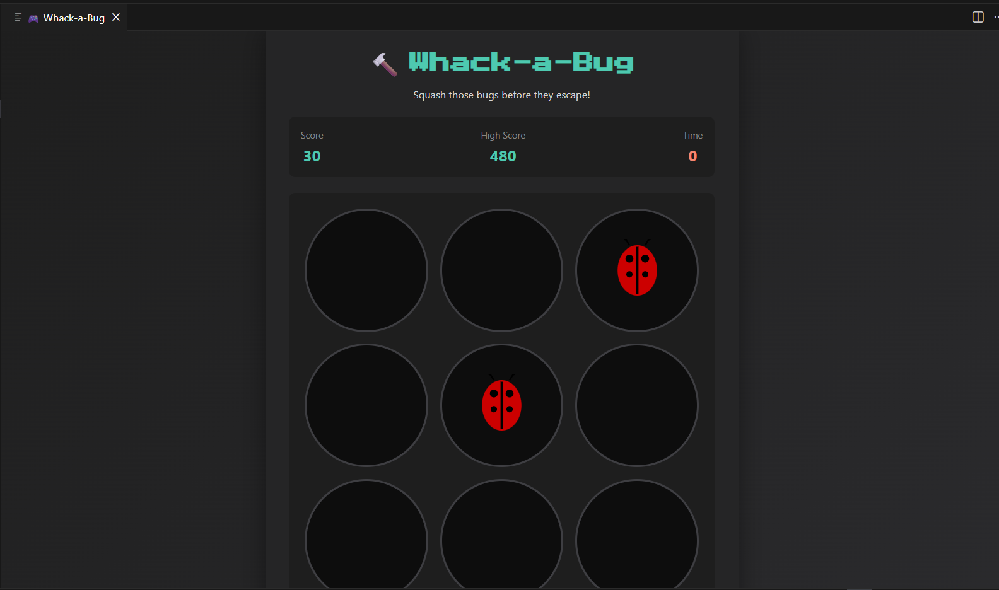
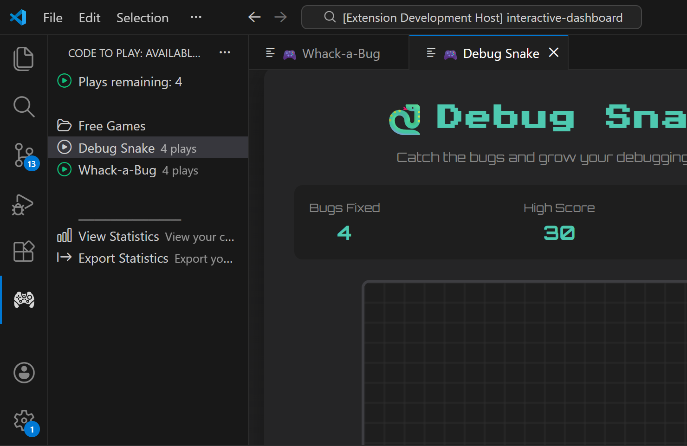
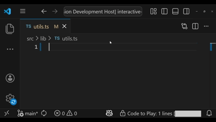
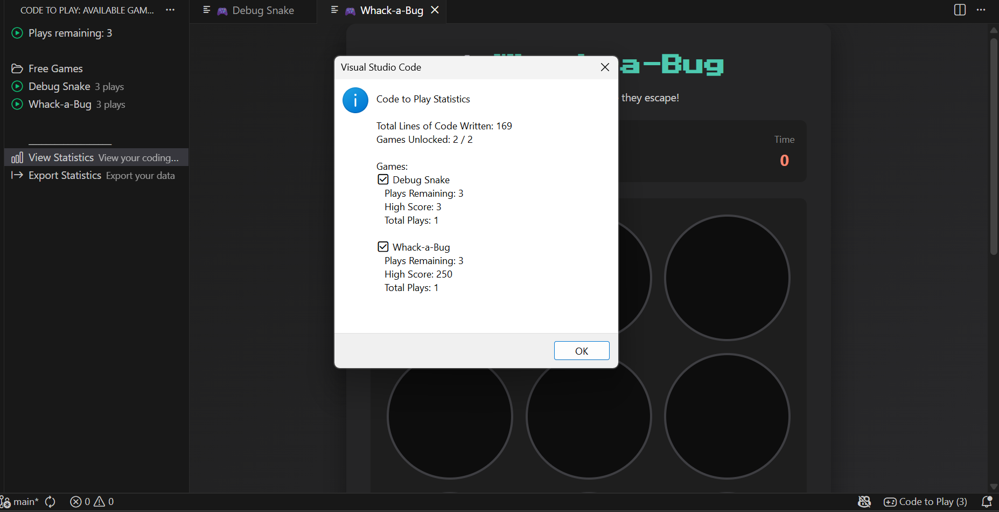

# Code to Play - Unlock Games While You Code

Code to Play gamifies your coding experience by unlocking fun mini-games
as you write code. Every 1000 lines unlocks 5 plays across all games.
Track your progress, compete against your high scores, and take fun
breaks without leaving VS Code.




## Why Code to Play?

Coding sessions can be intense. Code to Play gamifies your workflow by rewarding your progress with classic mini-games. Write meaningful code, unlock plays, and enjoy guilt-free breaks—all within VS Code.
Perfect for:

- Staying motivated during long coding sessions
- Taking mental breaks without context switching
- Tracking progress with automatic code line counting
- Having fun while being productive
- Reducing risk of burnout and stress



## Features

### Multiple Mini-Games

Play classic games with a coding twist:

- **Debug Snake** - Catch bugs (ladybugs) and grow your debugging skills
- **Whack-a-Bug** - Click bugs before they escape in this fast-paced game
- **Call Stack** and **Merge Conflict** — Pro games. New Pro checkouts include a **7-day free trial**.

### Smart Code Tracking

- Automatically counts meaningful lines of code
- Excludes comments, blank lines, and trivial changes
- Supports 13+ programming languages. [Click to check supported files](./TRACKEDEXTENSIONS.md)
- File type tracking
- Real-time progress updates

### Progressive Unlock System

- Write code to unlock plays
- Default: 1000 lines = 5 plays.
- Global play counter shared across all games
- Visual progress in status bar
- Unlock notifications to celebrate milestones




### High Score System

- Track your best performances
- Local storage - your data stays private
- Per-game high score tracking
- Reset individual high scores anytime
- Compete against yourself!

### Detailed Statistics

- Beautiful stats dashboard
- Total lines written
- Total plays across all games
- Per-game breakdowns
- Export your data as JSON

### Privacy First

- **Zero telemetry** - no data collection
- All data stored locally
- No internet required
- No external API calls
- Your code stays private



## Installation

1. Open VS Code Or any VS Code dependent IDE (e.g. cursor).
2. Go to the Extensions view (`Ctrl+Shift+X` or `Cmd+Shift+X` on Mac).
3. Search for "React Next.js Smart Snippets".
4. Click Install.
5. Reload the IDE if prompted.

### Getting Started in 3 Steps

#### Start Coding

Open any supported code file (`.ts`, `.js`, `.py`, `.java`, etc.) and start writing code.

#### Watch Your Progress

Check the status bar (bottom of VS Code):

- **Locked:** `450/1000 lines` - Keep coding!
- **Unlocked:** `5 plays` - Ready to play!

#### 3️⃣ Play Games!

1. Click the 🎮 **Code to Play** icon in the Activity Bar (left sidebar)
2. Choose a game from the list
3. Click to play and enjoy your break!

---

## 🔧 How It Works

### Code Tracking Algorithm

Code to Play uses a smart algorithm to count only meaningful code:

**✅ Counted as Code:**

- Function and class declarations
- Variable assignments and declarations
- Control flow statements (if, for, while, etc.)
- Method calls and expressions
- Import/export statements

**❌ Not Counted:**

- Comments (single-line `//` and multi-line `/* */`)
- JSDoc comments (`/** */`)
- Blank lines
- Lines with only braces `{` `}`
- Whitespace-only lines

**Language Support:**
JavaScript, TypeScript, Python, Java, C, C++, C#, Go, Rust, PHP, Ruby, Swift, Kotlin, and more!

### Unlock Flow

```
Write Code → Track Lines → Reach Threshold → Unlock Games
    ↓
  Play → Use 1 Play → Repeat
    ↓
  No Plays Left → Lock → Write More Code
```

### Data Storage

All data is stored locally using VS Code's storage API:

**Stored Data:**

- High scores per game
- Total plays per game
- Total lines written
- Current unlock status
- Plays remaining

**Privacy:**

- No data sent to external servers
- No telemetry or tracking
- Everything stays on your machine
- Uninstall removes all data

---

## ❓ Frequently Asked Questions

### General

**Q: How do I unlock games?**  
A: Write code! Default is 1000 meaningful lines = 5 plays. Watch the status bar for progress.

**Q: What languages are supported?**  
A: JavaScript, TypeScript, Python, Java, C/C++, C#, Go, Rust, PHP, Ruby, Swift, Kotlin, and more. [Click to check supported files](./TRACKEDEXTENSIONS.md)

**Q: Can I adjust the unlock threshold?**  
A: The default unlock threshold is 1000 meaningful lines of code for 5 plays. This is configured in the extension's default settings.

**Q: Do games work offline?**  
A: Yes! Everything runs locally. No internet required.

**Q: Does this slow down VS Code?**  
A: No! Code to Play uses minimal resources and only tracks when you're actively coding.

**Q: Why aren't my lines being counted?**  
A: Check that your file type is in the [tracked extensions](./TRACKEDEXTENSIONS.md) list. Also ensure "Count Meaningful Lines Only" isn't excluding your code style.

---

## 🗺️ Roadmap

### Coming Soon

- 🎮 More games (Tetris, Space Invaders, Pong)
- 🎚️ Difficulty levels for existing games
- 🏅 Achievements system
- 📊 More detailed statistics
- 🎨 Custom themes
- 🔊 Sound effects (toggleable)
- 📅 Daily challenges

### Under Consideration

- Multiplayer leaderboards (opt-in)
- Team competitions
- Custom game creation API
- Integration with GitHub contributions
- Online games.

**Want to suggest a feature?** [Open an issue!](https://github.com/Victor-Okenwa/code-to-play/issues)

---

## 🐛 Known Issues

No major issues currently reported.

**Report a bug:** [GitHub Issues](https://github.com/Victor-Okenwa/code-to-play/issues)

---

## 📜 License

This extension is licensed under the [Apache License](LICENSE).

### Third-Party Assets

**Fonts:**

- **Press Start 2P** by CodeMan38 - [SIL Open Font License](https://scripts.sil.org/OFL)
- **Orbitron** by Matt McInerney - [SIL Open Font License](https://scripts.sil.org/OFL)

Special thanks to the font creators for making these available!

---

## About the Author

- Email: okenwavictor003@gmai.com

- X: https://x.com/morse_code_001

- LinkedIn: https://www.linkedin.com/in/victor-okenwa/

- Support Me: Buy me a coffee on Patreon https://patreon.com/morse_code

<div align="center">

**Made with ❤️ by developers, for developers**

[GitHub](https://github.com/Victor-Okenwa/code-to-play) • [Report Issue](https://github.com/Victor-Okenwa/code-to-play/issues) • [Request Feature](https://github.com/Victor-Okenwa/code-to-play/issues/new)

\*\*Happy coding and gaming!

</div>
